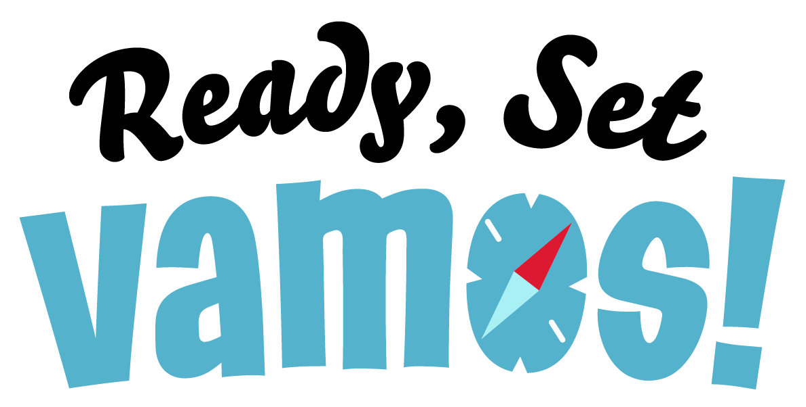

 

  

  <h3 align="center">An App for sustainable tourism.</h3>
  

    
    
    
  

  
Index

  <ol>
    <li>
      <a href="#treasure-hunt">Treasure-Hunt</a>
    </li>
  </ol>

# Treasure-Hunt

Google Fonts - Fredoka
https://fonts.google.com/specimen/Fredoka#standard-styles
- Used on all the text.

- Colors -

DarkBlue - #54B2CC
- used mostly as a higlight color, title color and interactable buttons.

LightBlue - #A8F0F4
- used mostly as a secondary higlight color and background color. fx. all inputs are this color but with a 50% opacity.

DirtyBlue - #A2D5E3
- used mostly for interactable buttons and interactable icons.

lightGrey - #EDEDED
- used mostly for background

GreyText - #737373
- Used on all none interactable text on light backgrounds.

WhiteText - #ffffff
- Used on all none interactable text on dark backgrounds.

GoldText - #C49047
- Used for gold Text

SilverText - #929292
-Used for silver Text

BronzeText - #BC7546
- Used for bronze Text

DeleteRed - #FF7088
- used on the delete button

LogoutGrey - #EDEDED
- used on the Logout button

- Global Goals Colors -

3 - #279B48
5 - #EF402B
7 - #FDB713
8 - #8F1838
11 - #F99D26
12 - #CF8D2A
13 - #48773E
15 - #3EB049
16 - #02558B
17 - #183668
